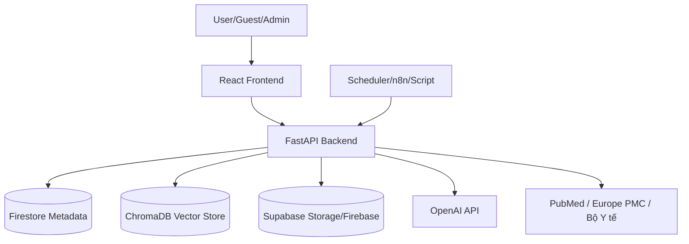

# BÁO CÁO HỆ THỐNG: HỆ THỐNG TRI THỨC HỖ TRỢ TRA CỨU SỨC KHỎE

## 1. Tổng quan hệ thống

- **Tên hệ thống:** Hệ thống tri thức Hỗ trợ tra cứu Sức khỏe (RAG AI Platform).
- **Mục tiêu:** Xây dựng một nền tảng quản trị và tra cứu tri thức y tế đáng tin cậy. Hệ thống thu thập, xử lý, duyệt và chuẩn hóa dữ liệu từ nhiều nguồn y khoa uy tín để phục vụ tìm kiếm tài liệu và hỏi đáp AI một cách an toàn, hạn chế tối đa tình trạng AI bịa đặt thông tin (hallucination).
- **Đối tượng sử dụng:** 
  - *Người dùng (User/Guest):* Tra cứu tài liệu, đọc tin tức y tế, tìm kiếm thông tin sức khỏe, đặt câu hỏi cho AI dựa trên nguồn tin uy tín.
  - *Quản trị viên (Admin/Bác sĩ):* Quản lý nguồn dữ liệu, duyệt tài liệu trước khi đưa vào hệ thống, quản lý người dùng và theo dõi chất lượng.
- **Vấn đề thực tế:** Thông tin y tế trên Internet trôi nổi, khó kiểm chứng. Các chatbot AI thông thường dễ sinh ra thông tin y tế sai lệch do thiếu ngữ cảnh hoặc nguồn tài liệu không đảm bảo.
- **Giải pháp hệ thống đưa ra:** Áp dụng kiến trúc RAG (Retrieval-Augmented Generation) kết hợp với **Quy trình quản trị tri thức (Knowledge Governance)**. Mọi câu trả lời của AI đều phải dựa trên các tài liệu đã được Admin duyệt và lưu trong kho tri thức của hệ thống.
- **Vì sao đây là “nền tảng tri thức” chứ không chỉ là chatbot?**
  - Hệ thống thu thập/cập nhật tri thức đa nguồn (Multi-source ingestion).
  - Có quản trị/duyệt tri thức: Tài liệu phải qua luồng `Pending Ingest` để duyệt trước khi vào Vector Store.
  - Có chức năng tìm kiếm tài liệu hoàn toàn độc lập (Search Engine thu nhỏ).
  - Có hỏi đáp AI dựa trên kho tri thức, nhưng "Chat" chỉ là một công cụ tiện ích khai thác dữ liệu đã được quản lý.
  - Có tin tức/blog y tế tự động cập nhật.
  - Có phân quyền người dùng chặt chẽ qua Firebase.

---

## 2. Kiến trúc tổng thể

### Frontend
- **React UI:** Ứng dụng Single Page Application (SPA) xây dựng bằng Vite/React.
- **Landing page:** Trang chủ giới thiệu hệ thống.
- **Search page:** Trang tìm kiếm tài liệu đa nguồn độc lập.
- **Document detail:** Trang xem chi tiết tài liệu (kèm trình xem PDF nội bộ).
- **Blog/news:** Giao diện hiển thị tin tức y tế.
- **Ask AI chatbox:** Giao diện trò chuyện trực tiếp với AI (cùng tính năng gợi ý và upload).
- **Admin UI:** Bảng điều khiển quản lý Nguồn, Tài liệu chờ duyệt, Quản lý tài liệu (Governance), và Analytics.

### Backend
- **FastAPI:** Nền tảng Backend Python xử lý toàn bộ logic nghiệp vụ, tối ưu cho xử lý bất đồng bộ (async).
- **API routes:** Định nghĩa các endpoint (ví dụ: `/api/search`, `/api/ask`, `/api/admin/...`).
- **Services:** Chứa logic nghiệp vụ lõi (vd: `ingest_orchestration_service.py`, `ask_service.py`, `search_service.py`).
- **Repositories:** Tương tác với CSDL NoSQL (Firestore).
- **Models/Schemas:** Định nghĩa cấu trúc dữ liệu Pydantic và Model.
- **Auth dependencies:** Middleware phân quyền bằng Firebase Custom Claims (`authz.py`).

### Database / Storage
- **Firestore/Firebase:** Cơ sở dữ liệu chính của hệ thống. Dùng để lưu trữ Metadata quan trọng: Danh sách Nguồn (Sources), Tài liệu (Documents), Phiên bản (DocumentVersions), Hàng chờ duyệt (PendingIngests), Lịch sử Chat, Feedback, và Quản lý người dùng.
- **ChromaDB:** Vector Database lưu trữ các đoạn văn bản (chunks) và vector nhúng (embeddings) để phục vụ cho Semantic Search và AI Context Retrieval.
- **Supabase Storage:** Dùng làm Object Storage để lưu trữ các file vật lý gốc (đặc biệt là PDF). Khi triển khai, Backend không lưu PDF trên ổ cứng local mà đẩy lên Supabase và sinh Presigned URL cho người dùng đọc.
- **Local path:** Chỉ dùng làm nơi lưu tạm (temp files) trong lúc xử lý/ingest tài liệu.

### External services
- **OpenAI:** Cung cấp API LLM (`gpt-4o-mini` hoặc tương tự) để sinh câu trả lời và Embedding model (`text-embedding-3-small`) để nhúng vector.
- **PubMed / Europe PMC / Bộ Y tế:** Các nguồn dữ liệu bên ngoài được tích hợp thông qua các Fetcher script để kéo bài viết/tin tức sức khỏe.
- **n8n / Scheduler:** Đóng vai trò tự động hóa (automation workflow) định kỳ crawl dữ liệu web/tin tức, bóc tách HTML, phân loại, sau đó gọi webhook/API nội bộ (`/api/n8n/...`) để đẩy bài viết vào hàng chờ duyệt.
- **Firebase Auth:** Dịch vụ xác thực người dùng (đăng nhập email/Google/Phone).

### Sơ đồ kiến trúc

---

## 3. Các câu hỏi phản biện và giải đáp

### 1. Hệ thống của tôi làm gì?
Hệ thống giúp tự động tổng hợp, phê duyệt và lưu trữ các tài liệu, bài báo, thông tin y khoa uy tín. Từ kho tri thức sạch này, hệ thống cung cấp bộ máy tìm kiếm (Search Engine) và trợ lý ảo (Ask AI) cho phép người dùng tra cứu thông tin y tế chính xác một cách nhanh chóng.

### 2. Vì sao hệ thống này không chỉ là chatbot?
Bởi vì hệ thống đặt sự **Quản lý Tri thức (Knowledge Governance)** làm trung tâm:
- Có quản lý Nguồn dữ liệu độc lập (Source Registry).
- Có chức năng Tìm kiếm (Search) hoàn toàn độc lập với hộp thoại Chat.
- Chatbot chỉ là một module phụ (consumer) nằm phía trên kho tri thức đã được chuẩn hóa. Triết lý này được nhấn mạnh tại `TASKS.md`.

### 3. Kiến trúc tổng thể gồm những thành phần nào?
Hệ thống gồm 3 khối chính: 
1. **Frontend (React)** cung cấp portal giao diện đa tính năng.
2. **Backend (FastAPI)** xử lý logic, nghiệp vụ, phân quyền, giao tiếp AI.
3. **Storage/Data Layer:** Firestore (Lưu Meta), ChromaDB (Lưu Vector), Supabase (Lưu File PDF), kết hợp **n8n** tự động lấy dữ liệu.

### 4. Backend xử lý dữ liệu thế nào?
Dữ liệu đổ vào (từ Upload hoặc n8n) sẽ qua hàng chờ (`Pending Ingest`). Admin duyệt xong, Backend sẽ tính checksum để kiểm tra trùng lặp (Dedup). Sau đó, tài liệu mới được cắt thành mảnh (Chunking), nhúng vector (Embedding), lưu raw file lên Supabase và lưu metadata xuống Firestore. Logic này nằm tại `src/backend/app/services/ingest_orchestration_service.py`.

### 5. Frontend gọi API gì?
Frontend tương tác với Backend qua các REST API chính:
- **Search:** `GET /api/search`, `GET /api/search/multi`
- **Ask AI:** `POST /api/ask`
- **Admin Governance:** `PATCH /api/admin/governance/documents/{id}/approve`
- **Ingest:** `POST /api/admin/n8n/documents/pending`, `POST /api/user/upload/documents`

### 6. n8n hoặc scheduler đóng vai trò gì?
n8n (workflow nằm tại thư mục `n8n workflow/` với các file nhúng như `fetch_web.py`, `skds_article_extractor.py`) đóng vai trò là công cụ crawl tự động. Nó định kỳ theo dõi các trang web y tế, báo sức khỏe, trích xuất văn bản (HTML clean), và gửi tự động tới API của Backend để đưa bài mới vào hàng chờ.

### 7. ChromaDB dùng để làm gì?
ChromaDB là Vector Store chuyên dụng, dùng để lưu trữ các "chunk" văn bản và Vector sinh ra từ OpenAI. Nhiệm vụ chính của nó là hỗ trợ truy vấn Semantic Search để tìm ra những đoạn văn bản có nghĩa sát nhất với câu hỏi của người dùng (`src/backend/app/chroma_manager.py`).

### 8. Firestore/Firebase/Supabase dùng để làm gì?
- **Firestore/Firebase:** Dùng làm NoSQL Database lưu trữ toàn bộ các bảng quan hệ logic (Metadata): User, Document, DocumentVersion, Source, IngestJob, PendingIngest.
- **Supabase Storage:** Dùng làm Object Storage lưu trữ các file PDF gốc (`src/backend/app/services/file_storage_service.py`).

### 9. Luồng ingest tài liệu PDF/web hoạt động ra sao?
1. Dữ liệu từ user hoặc n8n đẩy vào Backend -> tạo bản ghi `PendingIngest` (`src/backend/app/services/pending_ingest_service.py`).
2. Admin xem xét và bấm "Approve".
3. Kích hoạt `IngestOrchestrationService`. File được tính mã băm (Checksum). Nếu trùng hoàn toàn -> bỏ qua. Nếu có thay đổi -> tạo `DocumentVersion` mới.
4. Tải PDF lên Supabase.
5. Chunking văn bản -> tạo Embeddings -> Đẩy vào ChromaDB.
6. Cập nhật trạng thái `Document` thành Active.

### 10. Search hoạt động ra sao?
Khi người dùng tìm kiếm, Backend nhận request tại `src/backend/app/api/search.py`.
Class `SearchService` hoặc `MultiSourceSearchService` sẽ thực thi:
- Keyword search, Semantic search (từ ChromaDB), hoặc Hybrid search.
- Trả về danh sách Document kèm theo các mảnh nội dung (snippets) phù hợp, cùng thông tin gốc để người dùng trích dẫn.

### 11. Ask AI hoạt động ra sao?
Hệ thống nhận câu hỏi qua `/api/ask`. Tệp `src/backend/app/services/ask_service.py` tiếp nhận.
- `AskContextService` (`ask_context_service.py`) sẽ gọi DB và ChromaDB để truy xuất các tài liệu liên quan nhất làm ngữ cảnh (Context).
- Đưa câu hỏi và Context vào cấu trúc Prompt (`prompt_registry.py`).
- Gọi OpenAI sinh câu trả lời và stream kết quả (Server-Sent Events) về Frontend từng chữ một.

### 12. Admin duyệt tri thức như thế nào?
Admin sử dụng giao diện quản trị (Governance). Backend xử lý tại `src/backend/app/api/admin_governance.py` và `src/backend/app/services/governance_service.py`. Admin có thể "Approve" (duyệt hàng chờ), "Reject" (từ chối), hoặc "Deactivate" (ngưng kích hoạt một tài liệu cũ nếu thấy thông tin sai lệch hoặc lỗi thời).

### 13. User/Guest/Admin phân quyền ra sao?
Xác thực bằng **Firebase Auth** kết hợp **Custom Claims**. Khi đăng nhập, Firebase trả về JWT Token. Middleware tại `src/backend/app/api/dependencies/authz.py` (`require_authenticated_principal`) sẽ giải mã Token. Nếu Token có Claim `admin: true`, user được gán quyền `Role.admin` và có thể dùng các API quản trị.

### 14. Blog/tin tức y tế hoạt động ra sao?
Có các Fetcher được thiết kế riêng:
- `src/backend/app/services/pubmed_fetcher.py`
- `src/backend/app/services/moh_fetcher.py`
- `src/backend/app/services/external_news_ingest_service.py`
Các service này sẽ lấy bài viết, làm sạch dữ liệu, lưu thành Model `Article` (vào Firestore thông qua `article_repository.py`) để render trên trang Blog/News của Frontend.

### 15. PDF được lưu và mở như thế nào khi deploy?
Không lưu trên ổ cứng local. `src/backend/app/services/file_storage_service.py` đảm nhận việc đẩy PDF lên Supabase. Khi người dùng muốn xem tài liệu trên Frontend, Backend sẽ gọi API của Supabase để sinh ra một Presigned URL (link có thời hạn). Frontend dùng link này để nhúng và hiển thị file.

### 16. Những file code chính của từng chức năng là gì?
- **Entry point Backend:** `src/backend/app/app.py`
- **Quản lý Quyền (Authz):** `src/backend/app/api/dependencies/authz.py`
- **Tìm kiếm (Search):** `src/backend/app/services/search_service.py`, `multi_source_search_service.py`
- **Hỏi đáp AI (Ask):** `src/backend/app/api/ask.py`, `src/backend/app/services/ask_service.py`
- **Luồng Duyệt & Ingest:** `src/backend/app/services/ingest_orchestration_service.py`, `pending_ingest_service.py`
- **Quản trị (Governance):** `src/backend/app/services/governance_service.py`
- **Lưu File PDF:** `src/backend/app/services/file_storage_service.py`
- **Database (Firestore):** Các tệp trong `src/backend/app/repositories/`

### 17. Những điểm mạnh, điểm hạn chế, rủi ro còn lại là gì?
**Điểm mạnh:**
- Kiến trúc chia Layer (Controller -> Service -> Repository) rất rõ ràng, chuyên nghiệp.
- Quy trình quản trị tri thức (Governance) chặt chẽ, chống rác dữ liệu (Hallucination prevention).
- Chức năng Tìm kiếm độc lập tăng trải nghiệm cho người dùng không muốn chat.
- Có luồng tự động (n8n/Fetchers) giúp dữ liệu luôn "sống" (Self-updating).

**Điểm hạn chế & Rủi ro:**
- **Firestore (NoSQL):** Khi dữ liệu tăng cực lớn, việc thực hiện các câu truy vấn phức tạp, đa điều kiện, phân trang, hay join nhiều bảng sẽ khó và tốn chi phí đọc (Read operations).
- **Phụ thuộc bên thứ ba:** Phụ thuộc cứng vào OpenAI cho LLM và Embedding. Nếu OpenAI bị lỗi hoặc đổi giá, hệ thống sẽ ảnh hưởng trực tiếp (Tuy nhiên hệ thống đã bọc OpenAI vào `openai_factory.py` để dễ thay module sau này).
- Trích xuất PDF dạng hình ảnh hoặc có bảng biểu (tables) phức tạp vẫn phụ thuộc vào chất lượng module Chunking.

### 18. Nếu hội đồng hỏi “logic code nằm ở đâu?” thì tôi chỉ được file nào?
Tuyệt đối KHÔNG chỉ vào các file trong thư mục `src/backend/app/api/` (vì đó chỉ là Controller để nhận/đáp HTTP Request).
Hãy chỉ vào thư mục chứa não bộ của hệ thống: 👉 `src/backend/app/services/`
- Nếu hỏi xử lý tải và cắt tài liệu: Chỉ vào `ingest_orchestration_service.py`.
- Nếu hỏi Chat AI xử lý thế nào: Chỉ vào `ask_service.py` và `ask_context_service.py`.
- Nếu hỏi Tìm kiếm hoạt động ra sao: Chỉ vào `search_service.py`.
- Nếu hỏi lưu CSDL thế nào: Chỉ vào `src/backend/app/repositories/`.
